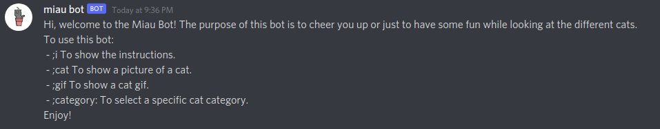
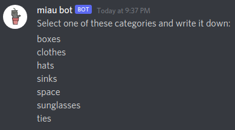
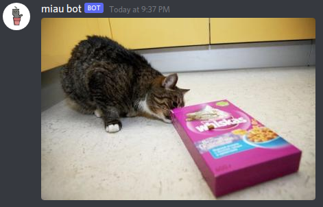

# Cat-Generator-Bot
Bot made with the Discord Developer API and the official Cat API that generates a cat image when different commands are invoked.
The commands are the following:
```bash
  ;i : for the instructions.
  
  ;cat : for a cat image.
  
  ;gif : for a cat gif.
  
  ;category : for a specific cat category.
```

# Invite the bot

To invite the bot to your discord server, click this [link](https://discord.com/api/oauth2/authorize?client_id=883771045042069524&permissions=120259210240&scope=bot)

# Bot Examples







# Disclaimer

This bot is made for fun, it is possible that the bot is not always going to be running. Sorry for the inconveniences.


